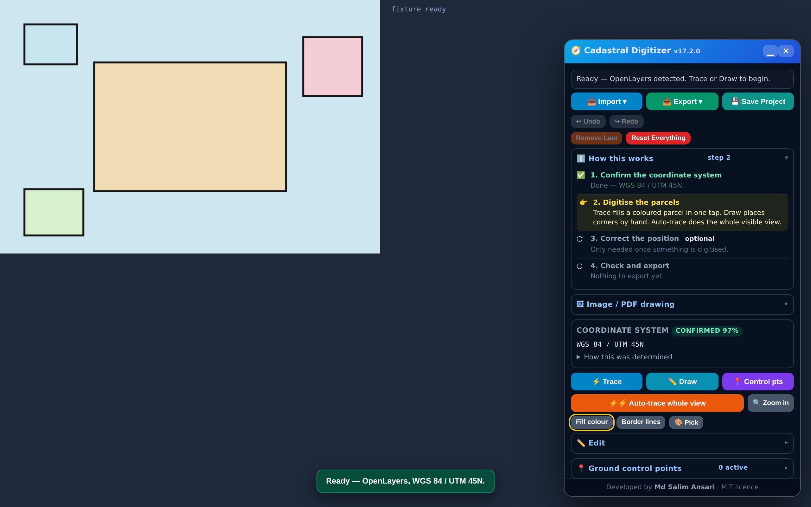
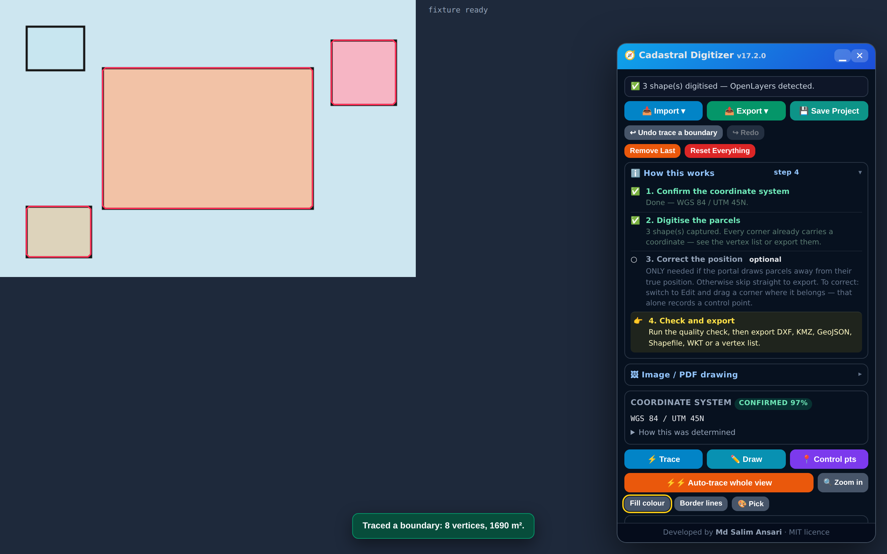
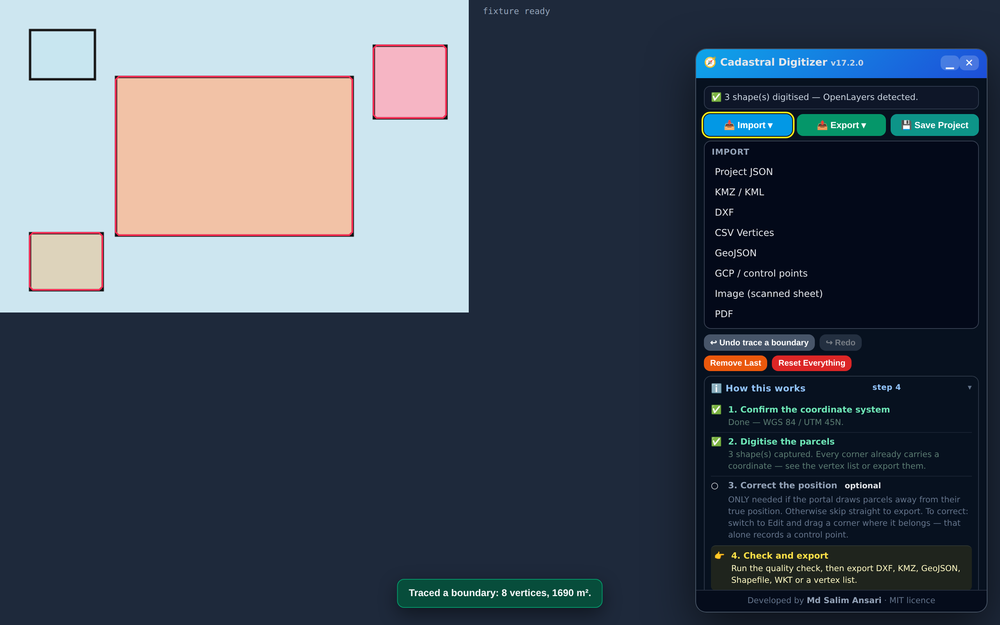
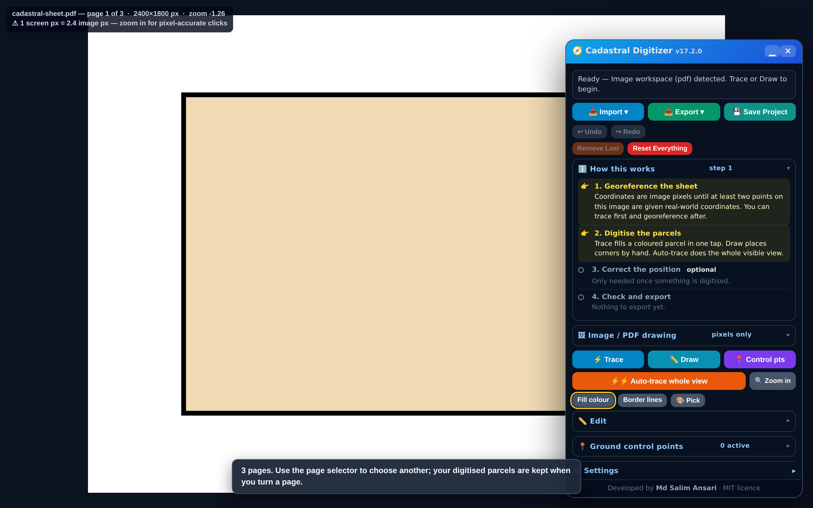
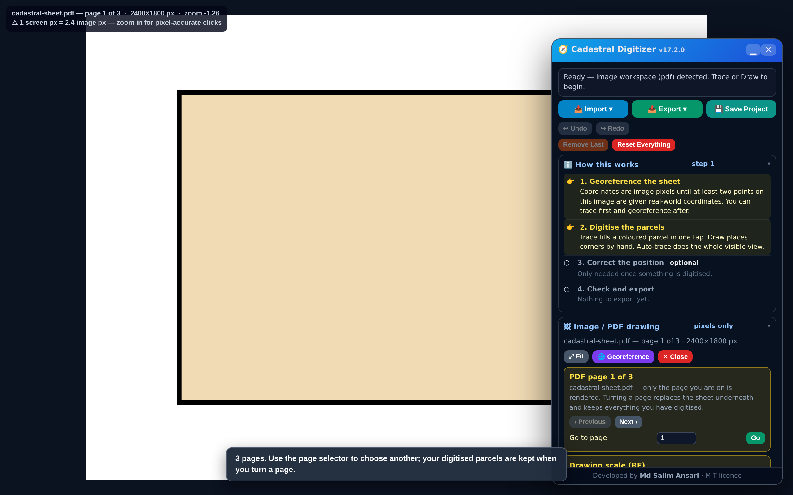

# Cadastral Digitizer — v17.6.1

**Developed by Md Salim Ansari** · MIT licence (see [LICENSE](LICENSE))

Browser extension for digitizing parcels from cadastral and GIS sources. Colour tracing, batch vectorisation, draggable ground control points with cross-validated georeferencing, topology clean-up, **import of existing cadastral geometry from DXF, KMZ/KML, CSV and GeoJSON**, **non-destructive parcel move/rotate/scale**, **RF and scale-bar calibration of scanned drawings**, and export to DXF, KML, KMZ, GeoJSON, Shapefile, WKT and CSV.

Works on **any** portal running OpenLayers, Leaflet, MapLibre, Mapbox GL or Google Maps — and on **scanned sheets, images and PDF pages**.

**Install:** `chrome://extensions` or `edge://extensions` → Developer mode → Load unpacked → select this folder.
**Use:** open a map portal, image or PDF, click the toolbar button (or press `Ctrl+Shift+U`).
**Package:** `npm run package` → `dist/cadastral-digitizer-<version>.zip`, ready to upload to the Chrome Web Store. Submission answers — single purpose, permission justifications, data-usage declarations and a privacy policy — are drafted in [docs/chrome-web-store.md](docs/chrome-web-store.md).
**Tests:** `npm test` — 686 tests. No install needed: 548 run immediately, and 138 that need a browser skip cleanly. To enable those:

```bash
npm install --no-save jsdom            # 80 DOM integration tests
npm install --no-save playwright-core  # 20 real-Chrome E2E tests (needs a Chrome binary)
```

**CI:** `.github/workflows/test.yml` runs the suite twice on every push and pull request. Once against a **bare checkout with nothing installed**, because "most of it runs the moment you unzip it" is a promise the project makes and a change could quietly break while every other check stayed green; and once with both optional dependencies plus **Playwright's own Chromium**, where **no test may skip** — a silently skipped end-to-end run must not be mistakable for a passing one.

Deliberately not the runner's preinstalled Google Chrome: from **Chrome 137 the stable channel refuses `--load-extension` in headless mode**, so it loads no extension at all — `chrome://extensions` lists zero items, no service worker ever registers, and all twenty end-to-end tests sit on their timeouts. Measured on Chrome 152; `--headless=new` and `--disable-features=DisableLoadExtensionCommandLineSwitch` were both tried and neither helps. Playwright's build has no such restriction and is the same engine, so nothing is given up.

---

## What it looks like

| | |
|---|---|
|  |  |
| **Opened on a portal.** The coordinate system is detected and reported with a confidence, not assumed. | **Three parcels traced.** One tap each; every corner already carries a coordinate, and the area is reported as it goes. |
|  |  |
| **Import.** Existing cadastral geometry from DXF, KMZ/KML, CSV or GeoJSON, a saved project, control points, a scanned image, or a PDF. | **A PDF, rendered by the extension itself** at 2400 px on its long edge — not a screenshot of one. |



**The page selector for a multi-page PDF.** Only the page you are on is rendered, and turning a page keeps everything you have digitised.

**These are shot against `test/fixtures/stub-map.html`, not a live portal** — a synthetic map with four painted parcels, which is what the end-to-end suite drives. The tracing in them is genuine: real rasterised canvas pixels, real flood fill, the real extension loaded unpacked in Chromium. But the *portal* is a stand-in, and it would be dishonest to present it as a screenshot of the tool working on a government site.

---

## New in v17

### One toolbar: Import ▾ · Export ▾ · Save Project

The panel used to carry nine export buttons in a flat block and no way in at all except a project file. There are now three primary controls. Import and Export open menus; **Save Project** is separate because it is a different action — one press to write `ProjectName.json`, saving over the current project rather than accumulating copies.

Both menus stay in the DOM when closed and are revealed with a class. That is not incidental: the browser-integration suite drives these controls by id, and a menu built only when opened would be unreachable to it — the tests would have had to be weakened to match.

### Importing existing cadastral geometry

| Format | Read |
|---|---|
| **DXF** | `LWPOLYLINE`, the older `POLYLINE`/`VERTEX`/`SEQEND` form, and separate `LINE` entities joined end-to-end. Layers preserved. `TEXT`/`MTEXT` falling inside a ring becomes that parcel's plot number, which is how cadastral DXFs label parcels. |
| **KMZ / KML** | Polygons, linear rings, names, descriptions, `ExtendedData` and `SimpleData` attributes. |
| **CSV vertices** | `ID,X,Y`, `ID,E,N`, `ID,X,Y,Z`, `ID,Lat,Lon` — with delimiter sniffing, a preview, and per-column mapping you confirm before anything is read. |
| **GeoJSON** | Because this tool writes it, and a format it writes but cannot read back is a gap the operator finds. |
| **Shapefile** | A zipped `.shp`/`.shx`/`.dbf`/`.prj`, or those files picked together. Polygons, multi-part polygons and lines; DBF attributes travel with the parcel and a plot-number field is recognised among them. |

Imported rings become **ordinary shapes**. Not a separate layer type with its own editor — the same objects a traced parcel produces, so Edit, Move, Clean-up, control points, undo/redo, area calculation and all eight exports work on them with no code path of their own. Supporting import was a reader, not a special case threaded through the application; the same argument the raster workspace made in v16.

**They are overlaid automatically.** Coordinates in the file are used as they are, so a DXF holding real eastings and northings lands where those eastings and northings are, and the *view* moves to the imported extent — never the geometry to the view.

**A DXF this tool exported is put back where it came from.** This was the real cause of the blank portal, and it was a bug in the *reader*. The DXF export defaults to `shift` mode: it writes true coordinates minus a round origin, records that origin in `$INSBASE`, and says in a comment to add it back — because some CAD setups round seven-digit numbers badly. Re-importing such a file landed the parcels a few hundred metres from the equator: the header scan read `$INSBASE` with a fixed eight-pair window that ran past the end of the variable and into `$EXTMIN`, so what came back was the drawing's minimum corner instead of the recorded origin. The origin was reported and never applied. The map then followed the parcels to open ocean, found no tiles, and appeared to go blank — and the drawing looked *correct* against that blank background, because the geometry and the camera were wrong together. The scan now reads to the next variable rather than a guessed distance, and the origin is added back only where it is demonstrably right: the coordinates as written must be impossible for the session's system and adding the origin must make them possible. A file exported in `absolute` mode fails that second test and is untouched, which is the double-shift the exporter's own comment warns about.

**"Read coordinates as" — the standing fact, stated once.** DXF has nowhere to record a coordinate system; a drawing that is in fact UTM 44N arrives as bare numbers every time. The Import menu carries the same kind of selector the Export menu has, and it stands in for a *missing* declaration: a file that states its own system — a shapefile's `.prj`, a GeoJSON, a KML — still wins over the box, so a stale setting can never silently reinterpret one. Left on **Work it out**, the behaviour is exactly what it was: the file's declaration, then the session's, then the question. Set to a zone, the file becomes *declared* rather than unknown, which means it takes the ordinary conversion path — choose 44N in a 45N session and the geometry is converted, not relabelled.

**The view moves only where there is something to look at.** A DXF routinely carries *local drawing* coordinates — a site datum a few hundred units from an arbitrary origin. Read as eastings and northings, `(250, 250)` in UTM 45N is a point on the equator off West Africa, and the import used to pan there: no tiles, blank map, parcels nowhere in sight. The parcels always imported correctly; only the camera was wrong. Now the target is checked against the session's coordinate system with the *existing* CRS engine, and where it does not name a plausible place the view stays put and says why — which is the information you need to fix the CRS.

**The coordinate system is converted when it is known, and asked for when it is not.** See below — this is the distinction the whole import path turns on.

**Unsupported content is skipped with a reason.** A cadastral KMZ routinely carries ground overlays, network links and 3D models; a DXF carries circles and splines with no vertex list. Refusing the whole file over one unreadable placemark is the wrong trade when the other forty parcels are good, so each is counted and named.

### A guest on someone else's page

The panel is injected into a working government portal, so the standard it is held to is that **the site must behave exactly as it did without it**.

Its stylesheet used to be the exception. Rules like `.card`, `.item`, `.list`, `.field`, `.ok` and `.body` went into the page's `<head>` unscoped, so a portal with a `.card` of its own had that card restyled — our border, our padding, our dark palette — and a `.list` of its own picked up `max-height:150px; overflow-y:auto`, clipping the site's content and giving it a scrollbar. Measured against a page built from the class names a Bootstrap-ish portal actually uses: **27 rules reached the host page. Now none do.** Every rule is anchored to `#bnd15-widget`, and a test rebuilds that portal-shaped page and fails if a single rule escapes.

The rest of the contact surface was already deliberate, and is pinned by tests so it stays that way:

- the overlay canvas is **`pointer-events:none`** — every gesture is read from the map container, so the canvas can never swallow a click meant for the site;
- the keyboard handler **returns immediately** when focus is in an `INPUT`, `TEXTAREA` or `SELECT`, so the portal's own search box keeps Ctrl+Z and Escape;
- click suppression attaches to the **map container only**, never the document, lasts 700 ms after a tap this tool actually consumed, and has an off switch — so the sidebar, menus and forms never see it;
- no host element is ever restyled, and the capture path hides only the extension's own four elements.

KMZ inflation uses the platform's `DecompressionStream('deflate-raw')`, present in Chrome and in Node ≥18, rather than bundling an inflate implementation that could not be tested here.

### Shapefile import

A shapefile is a multi-file dataset, so both practical ways in are accepted: **a ZIP**, which is how one is normally sent, or the **`.shp`, `.shx`, `.dbf` and `.prj` picked together**. The ZIP is unpacked in memory with the project's own reader — the one KMZ import already uses — and nothing is ever written to your computer.

What it does with what it finds:

- **Polygons and multi-part polygons.** Parts stay separate parcels rather than being merged into one ring across the gap between them. Lines import too; points cannot become a parcel and are counted and named instead of silently dropped.
- **Holes are reported, not imported.** This tool's geometry model is one ring per parcel with no holes. Importing an inner ring as its own parcel would put a solid plot inside the plot it was cut out of, and nothing downstream would flag it — so it is listed as skipped, with the reason.
- **DBF attributes travel with the parcel**, and a plot-number field is recognised among the names cadastral shapefiles actually use (`PLOT_NO`, `KHASRA`, `SURVEY_NO` and so on). Everything else is kept as attributes regardless, so a wrong guess costs nothing.
- **The CRS is read from `.prj`, or asked for.** An EPSG code is recovered and handed to the *existing* CRS engine — there is no second projection code. Where the `.prj` is missing or names something unrecognised, the coordinates are left exactly as they are and the panel asks which system they are in. **It never assumes WGS 84**, which on a cadastral parcel would be a silent error of hundreds of kilometres.

Imported parcels are ordinary shapes, so editing, snapping, area, quality checks and every export work on them with no code of their own.

### Showing and hiding parcels

Every parcel row carries an **eye**, and the Shapes header carries **Hide all / Show all**.

Hiding is **display only** — the parcel keeps its geometry, vertices, attributes, area, id and its place in the list, and is **still exported**. The hidden ids live in session state rather than on the shapes, so the saved project format is exactly what it was and a parcel cannot arrive hidden in someone else's copy of the file. It is a view control, not a filter and certainly not a delete.

### The selected parcel scrolls into view

With five hundred parcels the list is a 150 px window onto a very long column. Selecting a plot now scrolls its row into view.

Deliberately **not** `scrollIntoView()`, which walks up the ancestor chain and would scroll the portal's own map out from under you — only the list's own scroll position moves. It fires just when the selection changes, so scrolling by hand is never fought; it takes no keyboard focus, so typing is never interrupted; and it finds the row by the shape's id. Nothing is sorted, reordered or moved to the top.

### Hard Reset

One button, below the editing controls, and a second in the toolbar popup for when the panel itself is the thing that has stopped responding.

It restarts the **extension**, not the page. Whatever is running is cancelled, timers and listeners are released, temporary rasters and object URLs are let go, the panel is torn down, and startup runs again through the *same* `boot()` the extension normally uses — so there is only ever one startup path and one panel afterwards.

- **It does not ask.** A confirmation dialog is one more thing that might not respond when the reason you are pressing it is that something is stuck.
- **It does not reload the page.** Your portal keeps its map, its layers, its login and the parcel you had selected. Reloading would be the easy implementation and the wrong one.
- **Your files are untouched** — saved projects, exports, source images, PDFs and shapefiles are never written to.
- **Pressing it repeatedly is safe.** Everything `boot()` attaches is released first, so a second press cannot leave a second panel, a second keyboard handler or a second timer behind. That is asserted by test, because it is the kind of fault that would accumulate silently.
- **Your work comes back.** Restarting goes through the normal startup, which restores the autosaved session — so a hung extension costs you the hang, not your parcels.

### Coordinate systems: convert what is known, ask about what is not

Everything here rests on one distinction. Converting between two coordinate systems is **arithmetic** when both ends are actually known, and a **fabrication** when either is not. Those two cases deserve opposite treatment, and the first version of this release got the first case wrong.

**Converted, automatically.** KML and GeoJSON declare WGS 84 lon/lat by specification. A session on a BhuNaksha portal knows its own UTM zone. Both ends are known, so importing one into the other is exact and simply happens — the parcels land in the right place, and the panel says what was converted from what. An earlier build *refused* here and told the operator to go and reproject the file themselves, which was work the program could do exactly and they could only do approximately. That refusal is gone.

**Asked, never guessed.** A DXF or a CSV of bare numbers cannot say what system it is in, and neither can the session on a portal that declares nothing. Here a guess would put parcels in the wrong district with nothing downstream noticing, so the import **stops and asks** — and the parsed file is *held* while it does, so answering finishes the import rather than making you find the file again. The question carries the one thing the numbers genuinely can say: their **family**. Degree-range, Web Mercator range and projected-grid magnitudes are disjoint, so the panel will tell you "these look like a projected grid such as UTM" — and then stop, because the numbers cannot say *which zone* and inventing one is the error being avoided.

**Exports convert too.** The session works in whatever the portal serves, but a KMZ for Google Earth wants lon/lat. The Export menu carries a coordinate-system selector; choosing one converts the geometry on the way out, exactly, and leaves the session's own geometry untouched. Doing it here beats doing it afterwards in another tool, which is a second chance to get a zone wrong.

**One caveat, surfaced rather than swallowed.** `toWgs84` applies a datum shift; `fromWgs84` deliberately does not apply the inverse, because published Kalianpur/Everest parameters vary by source and region and are worth tens of metres — the project's standing policy is that datum shifts are never applied unless explicitly selected. So a conversion *into* a non-WGS 84 datum uses that datum's ellipsoid but not its shift, and the panel says so in as many words. Emitting coordinates tens of metres out on a cadastral boundary, silently, would be the worst of the available behaviours.

### Moving a parcel, non-destructively

The problem this exists for: field-surveyed geometry and the cadastral map's geometry describe the same plot but sit a few metres apart. Select the parcel and slide it into place — by drag, or by typing an exact ΔX/ΔY. Rotate and Scale work about the parcel's **own centroid**, so a rotation turns the plot where it stands instead of swinging it across the sheet.

Every such operation does two things: it moves the geometry, and it composes the same transform into a `shift` record stored *beside* the parcel:

```
p → scale · R(rotation) · p + (dx, dy)
```

Similarities compose to similarities, so this is exact rather than approximate — the record states precisely what has been done to the original however many operations were stacked, and there is a test asserting it reproduces stepwise editing to under a micrometre at real UTM magnitudes. Undo is `Ctrl+Z`, **Reset this shift** restores the original exactly by inverting the record, the pre-shift outline can be drawn dashed for comparison, and exports carry the corrected geometry because `shape.points` *is* the corrected geometry.

**Map pan and geometry move cannot be confused**, because they do not share a code path. A drag that grabs a parcel in Move mode is intercepted; everything else falls through to the map. Panning and zooming stay alive in every mode, as they have since v15.

### RF drawing scale, and why an RF alone is not enough

A scanned sheet marked 1:2000 can be given that RF directly. But **an RF cannot yield a ground scale by itself**, and this is the one place the upgrade brief asked for something that does not follow: an RF relates *paper* distance to ground distance, and a scanned image is measured in pixels. Converting between them needs the scan resolution:

```
ground metres per pixel = RF denominator / (DPI / 0.0254)
```

So the RF field is paired with a DPI field rather than a DPI being assumed silently — which would be exactly the invented certainty this project refuses elsewhere. 1:2000 at 300 dpi is 0.169333 m per pixel.

**Calibrating from a known distance needs no DPI at all**, which makes it the more reliable route, so it sits alongside rather than beneath: pick two points, type the real distance between them, done. Where both have been given, the two are cross-checked and a disagreement is reported with a note that the scale bar is the more direct measurement — they are independent measurements of the same quantity, so if they disagree one of them is wrong and the operator should be told rather than having whichever was entered last quietly win.

A calibration is stored in the project, converts pixel areas to ground areas on a sheet with no survey control at all, and **is never touched by zooming**. There is a test asserting a calibration record carries no display property.

### Collapsible panel

How this works, Clean-up, Edit, Ground control points, the drawing tools and Settings all collapse, and remember their state. `<details>` keeps contents in the DOM when closed, so the map gets the screen without putting any control out of reach.

### Undo · Redo · Remove Last · Reset Everything

All four now sit in one bar at the head of the editing controls, and all four are always present rather than appearing when they become useful — a control that comes and goes cannot be found reliably, and greying one out is the lesser problem. Move, rotate, scale, duplicate, import and calibration all record undo steps through the existing snapshot history; the test that finds every session-mutating line and demands a `commit()` above it covers the new operations exactly as it covered the old ones.

### Two arithmetic fixes found while building this

Both are the same defect, and it is the one this project already has form for — correct on small test coordinates, wrong at the magnitudes the program actually runs at.

- **The area centroid was 13 cm out on a rotated plot.** The shoelace centroid is a ratio of two sums that grow with the square of the coordinate magnitude while the answer depends on their difference. At Jharkhand UTM values the cross products reach ~1.1 × 10¹² for a plot of ~1600 m² — nine orders of magnitude of cancellation. It surfaced because Rotate and Scale turn about the centroid, and a pivot 13 cm from the true centre *translates* the parcel while claiming only to have rotated it. Both `centroidOfRing` and the new `ringCentroid` now accumulate in a local frame; drift under rotation is exactly zero at every angle tested.
- **`signedArea` had the same flaw**, costing about 0.15 ppm on a rotated plot. Far below any cadastral tolerance, but it is noise where double precision should give ~10⁻¹³, and area is this program's headline output. Same one-line fix; the error on a rotated 1600 m² plot went from 2.4 × 10⁻⁴ m² to 1 × 10⁻⁸ m².

---

## Images, scanned sheets and PDFs

Much cadastral material is not a web map at all: it is a scanned sheet, a photographed register page, or a PDF. **Image / PDF workspace** opens one and gives you the same tools on it — tracing, batch vectorisation, the vertex editor, regularisation, snapping, topology checks, quality scoring, every export format.

That is the payoff of having an adapter layer. A static raster is presented through exactly the interface a live map exposes, so nothing downstream needed changing; supporting an entirely new kind of source was one new adapter, not a special case threaded through the application.

Four ways in:

| Source | Use it for |
|---|---|
| **📂 Image (scanned sheet)** | A scanned sheet or photograph from disk. Full source resolution. |
| **📄 PDF** | A cadastral sheet as a PDF file. Rendered by the extension itself. |
| **📸 Capture view** | A PDF already open in Chrome's own viewer, and any map you want to digitise as a still image rather than live. |
| **🖼 Page image** | An image already displayed on the page. |

**How PDFs are read.** You pick the PDF *file*, and the extension rasterises it itself with a vendored copy of [PDF.js](https://mozilla.github.io/pdf.js/) — the same renderer Firefox ships. The page comes out at **2400 px on its long edge**, roughly 200 dpi for an A4 sheet, which is where plot numbers stay legible. From that point on it is an ordinary raster: it goes through the same hand-off a picked image uses, and the workspace never learns a PDF was involved.

- **Nothing is fetched.** PDF.js lives in `vendor/` and is injected into the page by the service worker straight from the extension package. No CDN, no `web_accessible_resources`, no network of any kind — the whole path works offline.
- **No new permissions.** The tab is already accessible because `activeTab` was granted when you opened the digitizer on it. Injecting the renderer uses the `scripting` permission the extension already has.
- **It runs on the main thread**, on purpose. Loading the worker bundle into the same context is PDF.js's documented way of doing this. A real `Worker` would be created from a `chrome-extension:` URL inside the *page's* world, where the portal's own Content-Security-Policy applies and a `worker-src` directive would block it. Rendering one sheet on the main thread is a smaller cost than an import that fails on whichever portals set that header. `isEvalSupported: false` keeps it off `eval` for the same reason.
- **Multi-page PDFs** get a page selector. Only the page you are on is rendered — rasterising a whole document at tracing resolution is how a tab runs out of memory. Turning a page replaces the sheet underneath and **keeps everything you have digitised**.
- **Very large pages are capped** at 40 megapixels and 12000 px per side, and you are told when that happened rather than being quietly handed a lower-resolution sheet.
- The bytes decide whether a file is a PDF, not its name: extensions and MIME types are both routinely wrong on files that arrive by email or a messaging app.
- **Plot numbers render even when the sheet does not embed its font.** PDF.js can fetch character maps and standard font data over the network, and this extension configures neither — so whether a sheet using one of the standard 14 fonts came out with blank text was an open question, and on a cadastral drawing the numbers are half of what is being read. Measured rather than assumed: it renders. The one case that would not is text using a predefined CJK character map, which a cadastral sheet does not.
- **A failed import costs you nothing.** Pick the wrong file by accident and the refusal is all that happens: the sheet you had open stays open, still paginated, still exactly where you left it.

**Capture view is still there**, for a PDF already open in Chrome's own viewer — PDFium's pixels are unreachable to an extension, so a capture is the only way in. The honest limitation of a capture is that it is **screen** resolution, not source resolution: zoom up first, and take a large sheet in sections. If you have the file, use **📄 PDF** instead.

It is no longer needed for a *protected map*: that case is now handled automatically — see below.

### Protected maps trace automatically

Many portals draw their basemap from another origin — Google satellite imagery being the usual one. That **taints the map canvas**: the browser refuses to hand its pixels to any script, `getImageData` throws, and colour tracing has nothing to read.

The extension used to stop there and say *"use Draw instead"*. On a sheet of two hundred plots that is not a workaround, it is a refusal.

It now falls back automatically. A raster the extension owns is captured, the **same** tracer runs on that, and the outline comes back through the **portal's own projection** — the live map stays the coordinate authority, so nothing about the resulting geometry is different. Both single-tap Trace and Auto-trace whole view use it, and there is still exactly one tracing engine.

- **Nothing about browser security is weakened.** No CORS workaround, no flags, no changed Chrome settings, no third-party responses touched. The capture uses the same `activeTab` grant the extension already has — **no new permission**.
- **Detection is technical, not a site list.** The question asked is "can these pixels be read?", so any portal with the same condition gets the same fallback and none is named in the code.
- **It captures the map, not the browser.** The panel hides itself for the moment of capture and is restored in a `finally`, so a failed capture cannot leave it hidden. The crop follows the map element where the adapter can name it, which keeps batch tracing off the portal's sidebar.
- **The scale is measured, not assumed.** The ratio between captured pixels and CSS pixels is computed from the capture itself rather than read from `devicePixelRatio`, which is wrong under browser zoom — and a wrong ratio would silently offset every traced vertex.

If the capture genuinely cannot be taken, *then* it says so and Draw remains available.

### Picking an image file

A scanned sheet picked through **Import → Image** is decoded from the **file's bytes**, not by pointing an `` at a URL for it.

That is not a detail. The `` would be created in the *page's* document, so the *page's* Content-Security-Policy decides what it may load — and a portal serving `img-src 'self' data:` blocks a `blob:` URL outright. The bytes are perfectly good; the page simply refuses them, and the browser reports it as a decode error indistinguishable from a corrupt file. That was a real report from the field: an ordinary PNG, refused with *"The browser could not decode that image."*

Reading the bytes has no URL for a policy to filter, and never treats a local path as an HTTP source. Where the engine has no `createImageBitmap` the object-URL path still runs, unchanged, and still hands the URL to the workspace to release when the sheet closes.

Tracing on a raster always samples the image at its **native** resolution regardless of display zoom, so unlike a live map there is no need to zoom in for precision — it is already there. The workspace tells you when you are zoomed out far enough that clicks are no longer pixel-accurate.

### Georeferencing an image

An image is honestly just pixels, so coordinates stay in pixels — and areas in px² — until you say otherwise. **🌐 Georeference** pairs image points with known real-world coordinates:

1. Choose whether your coordinates are lon/lat or a UTM zone.
2. Tap a point on the image whose real position you know — a surveyed corner, a published boundary mark.
3. Type that coordinate.
4. Repeat. Two points minimum; **three or more** lets the fit be cross-checked.

This reuses the same least-squares machinery that corrects a live map, with pixels as source and world coordinates as target, so it inherits robust outlier rejection, leave-one-out cross-validation and automatic model selection unchanged. Once georeferenced, every export carries real coordinates; until then, exports that require them refuse and say why rather than emitting pixel values dressed up as metres.

---

## A few things to know before you start

**The panel tells you where you are.** It opens with the whole job as four numbered steps — confirm the coordinate system, digitise, *optionally* correct the position, check and export — with the current step highlighted and one sentence saying what to do now. Step numbers used to appear only *inside* the control-point tool, so "Step 1 of 2" showed up with no indication of what the two steps were part of or whether they were needed at all.

**Pan and zoom work in every mode.** Earlier versions captured all mouse input whenever a tool was armed, so you could not move the map while digitizing. Now a *tap* is an action and a *drag* is a pan, so you can zoom in as far as the imagery allows at any point without leaving the tool.

**Your taps do not leak through to the portal.** When a tool is armed, a tap belongs to the digitizer, and the click is stopped before the site sees it. Without this, tapping to trace on BhuNaksha *also* re-selects a parcel, fires the portal's own popups, and can change the very view you are digitising. Cancelling `pointerup` alone is not enough — portals hang their handlers on `click`, which the browser synthesises afterwards from the same gesture — so the synthetic `click`, `mouseup`, `dblclick` and `contextmenu` are swallowed too, in the capture phase, for a short window after a consumed tap. Dragging and scrolling are never intercepted, so panning and zooming still reach the map. Switchable under Settings → Export &amp; page behaviour.

**Nothing moves your view unless you ask.** Auto-zoom before tracing is **off** by default. It was intrusive: it pulled the map out from under you, cost seconds per action, and on portals that reload imagery per view it caused visible churn. Precision zoom is now a **🔍 Zoom in** button, and a per-control-point 🔍, used when you want them.

**The coordinate system is not guessed.** If the extension cannot establish it from hard evidence, it says so and asks, rather than assuming. See below for why that matters more than it sounds.

---

## Ground control points

Correcting georeferencing drift is the core feature. Pairing is **explicit and two-step**: you nominate the vertex, then capture where it truly lies.

1. Click **📍 Control pts**.
2. **Step 1 — choose which vertex.** Tap a corner on the map, or pick it by index from the dropdown when the boundary is too dense to click accurately. The chosen vertex is ringed in yellow, and the panel shows its current stored coordinate.
3. **Step 2 — capture the true position.** Tap where that corner really is. The coordinate is captured automatically and echoed back numerically — stored position, true position, lon/lat, and the resulting shift — so you can check it rather than assume it.
4. Repeat on more corners. Each control point stays a draggable handle: zoom in as far as the imagery allows, pan freely, and drag to refine. Arrow keys nudge a pixel at a time, Shift for ten.
5. **Preview correction** draws a dashed outline of where the boundary will end up, updating live as you drag — so you review the correction instead of hoping.
6. **Apply** when it looks right.

Earlier builds inferred the vertex from whichever was nearest the click. That is a guess, and on a dense boundary or a corner shared by two parcels it is close to a coin flip — while the entire meaning of a control point is that the operator is asserting *this* corner belongs *there*.

`Alt`+tap places a **loose** control point instead, for correcting against something that is not an existing vertex: a surveyed mark, or a feature identifiable in the imagery.

Per-point controls: 🔍 zooms to it, `on`/`off` includes or excludes without deleting, ✕ removes. `Esc` mid-pairing cancels just that pairing, not the whole session. Control points survive a reload and export as a QGIS-compatible `.points` file.

### You may not need this step at all

Control points correct **positional drift** — the portal drawing parcels away from where they really are. If the portal's geometry is already in the right place, tracing and exporting is the whole job, and the panel's workflow guide marks this step **optional** rather than implying every job needs georeferencing.

### Several parcels at once

Selecting a parcel **adds** it to the selection; selecting it again takes it back out. Nothing is copied and nothing is merged — three selected parcels are three independent geometries that happen to be spoken to together.

**Shift X/Y, Rotate and Scale then act on all of them.** The distinction that matters is *one* transform, not one per parcel: a single delta is computed and applied to every member, and rotation and scaling use one common origin — the centre of the selection's bounding box, chosen over a centroid because it does not depend on which parcel was clicked first. So the block turns and resizes as a rigid arrangement, and relative spacing, individual shape, size and orientation are preserved **by construction** rather than checked for afterwards. Rotating each parcel about its own centre instead would spin them in place and quietly destroy the layout, which is exactly the bug this design forecloses.

Dragging works the same way: dragging a parcel that is already selected moves the whole selection by one pointer delta; dragging one that is not selects just it, so a stale selection from ten minutes ago cannot be moved by accident. The whole group move is **one undo step**.

With exactly one parcel selected, every path is the one that was there before — the same function, the same undo label, the same message. Vertex editing, Copy, Duplicate and Delete stay deliberately single-target and act on the last parcel selected: they are not translations, and applying them to a group silently is how parcels get lost.

### Editing a corner *is* tagging a control point

Every digitised vertex already carries a coordinate, whether it was traced, batch-vectorised or placed by hand. So dragging a corner in **Edit** mode to where it actually belongs makes exactly the same statement as the two-step pairing above: *the geometry says here, the truth is there.* That drag is now recorded as a control point automatically, using the corner's **pre-drag** position as the source.

The practical effect is that georeferencing becomes a by-product of ordinary editing. Straighten a couple of corners you know are wrong and you have a validated fit for every parcel you have not touched. Re-dragging the same corner refines its existing control point instead of stacking a second, contradictory one on top — that stacking is how a fit silently goes wrong. Nudges smaller than the snap tolerance are treated as tidying, not evidence. Switch it off under Settings if you want the two-step workflow only.

### A fill that escaped the parcel is caught

A colour flood fill can slip through a one-pixel gap in a drawn boundary and swallow the neighbouring parcels. The result is still a closed ring with a plausible area, so nothing downstream notices — the operator exports a boundary for the wrong piece of land and is never told.

Cadastral portals hand over the answer for free: they report the bounding box of the parcel you clicked. A trace reaching well beyond it has leaked, and that is *checkable* rather than guessable. If more than 8% of a trace falls outside the declared box (adjustable, or 0 to disable), the panel says so and names the likely remedy. `Leak protection` reduces how often this happens; this detects when it happened anyway.

The measurement is always recorded, whatever the warning threshold is set to, because the **quality report** grades on it separately — a heavy leak is the largest single deduction in the report, ahead of every geometry and georeferencing fault. A leaked trace is not an inaccurate boundary; it is a boundary for the wrong land, and a toast at trace time has long gone by the time anyone reviews the session.

### Adjacent boundaries no longer cross

Reported from the field: dragging one parcel's corner left its neighbour behind, turning a shared boundary into two edges that cross — which no cadastral map can mean. A corner shared with neighbouring parcels now **moves them with it**, so the boundary stays common. A junction where four parcels meet moves all four.

Two supporting changes:

- Overlap detection had a real gap. Two axis-aligned parcels overlapping in a band — say one digitised 2 m too wide — have *every* vertex of each lying exactly on the other's boundary, and their edges only touch or run collinear rather than properly crossing. Vertex-only containment missed it entirely, and axis-aligned parcels are the common case, not an edge case. Edge midpoints are now probed too.
- Warnings name only what **you just caused**. The panel compares the overlapping pairs before and after each operation and reports the difference, so a session that already had one problem does not blame it on the next thing you do.

### Undo and redo, for everything

Previously one operation was undoable: placing corners while drawing by hand. That was the wrong way round — a stray corner is the cheapest mistake in the program to fix, and applying a bad transform to forty parcels was the most expensive and the one with no way back.

`Ctrl+Z` / `Ctrl+Y` now cover tracing, batch vectorisation, deleting, vertex edits, applying a correction, regularising, snapping, reverting, and every control-point change. The buttons are **named** — *Undo apply translation to 12 shape(s)* — rather than leaving you to discover what they reverse by pressing them. While drawing, `Ctrl+Z` still means "take back that corner"; everywhere else it means "take back that operation".

It works by snapshotting the whole session document rather than asking each operation to implement its own inverse. An inverse can be forgotten or written subtly wrong, and then undo corrupts the session instead of failing loudly; a snapshot cannot be forgotten. The cost is memory, so the depth is bounded and reported.

Coverage is not asserted by listing the operations I remembered — that list missed georeference points and both file loaders on the first pass, and georeference points were *already* in the undo document, so an unrelated undo could silently revert georeferencing work. A test instead finds every line that mutates the session and requires a recorded step, with a short list of deliberate exemptions (a vertex drag commits at pointer-*down*, since the pre-drag position has to be captured before the drag moves it — committing again afterwards would make one drag take two presses to undo).

Loading a project replaces the entire session, which makes it the most destructive action in the program. It now warns if there is anything to lose, itemised, and is undoable either way.

### Reset really resets

Reported: clearing the session left the control points behind. There were three separate reset routines, each clearing a different subset of the state — one function now owns it, so a field cannot be forgotten by two callers out of three. **Clear everything** itemises what it is about to remove (shapes, control points, georeference points, revert backups, any unfinished polygon) and asks before doing it, instead of the old vague "remove every shape and control point" that was also, as it turned out, untrue.

### Coverage, not just count

The panel reports control-point spread **per shape**, because how points are spread matters more than how many there are. Four points clustered along one edge constrain that edge and extrapolate wildly everywhere else, while three at well-separated corners constrain the whole parcel — and a residual cannot tell you the difference. A clustered fit can show a beautiful residual and still be worthless twenty metres away.

It also names shapes with **no** control at all, and states plainly what *Move all N shape(s)* assumes about them: that they share the same drift as the ones you did tag.

### How to read the numbers

Five transform models are available, and the extension picks one for you by **leave-one-out cross-validation** — refitting without each point in turn and measuring how well it predicts the point it never saw. That is the same question `Apply` asks of every untagged vertex, so it is the honest one.

| Model | Minimum points | What it adds |
|---|---|---|
| **Shift only** (translation) | **1** | Moves the plot bodily. Cannot resize or rotate it, so it cannot deform anything. |
| Similarity | 2 | Scale and rotation on top of the shift. Preserves angles, changes size. |
| Affine | 3 | Shear and per-axis scale. Straight lines stay straight. |
| Projective | 4 | Perspective — for obliquely photographed or scanned sheets. |
| Thin-plate spline | 3 | Local rubber-sheeting through every point exactly. |

**Why "shift only" exists, and why it is usually the right answer.** With two control points a similarity fit is *exactly determined*: it passes through both points perfectly and reports zero error, whatever they say. Two sub-metre clicking errors 20 m apart are then absorbed as a genuine scale and rotation change — measured on the reported field case, a scale of 0.955 and a rotation of 0.99°, which throws a corner 100 m out by **4.8 m** while the panel claims an RMS of 0.000 m. A shift-only fit on the same two points moves that corner by **0.00 m** in error, because it has no scale or rotation to get wrong. Portal drift is overwhelmingly a bodily offset, so this is both the safer model and usually the truer one. It falls out of the existing cross-validation rather than being special-cased: with two points, translation is the only model that can be validated at all.

- **In-sample RMS** is the fit's error at its own control points. It always improves with more parameters, and for a thin-plate spline it is exactly zero by construction. When a fit is exactly determined (3 points with affine, 4 with projective, any TPS), the panel says so explicitly, because a reassuring `0.000 m` there is arithmetic, not validation.
- **Leave-one-out error** is the number that means something. Add one point beyond a model's minimum to get it.
- **Robust fitting** (on by default) runs RANSAC to find the largest self-consistent subset, then Huber-weights the rest. A mis-dragged point gets flagged red and down-weighted instead of quietly biasing everything. It is deterministic — the same points always give the same answer.
- Least squares spreads an outlier's error across *every* point, so a bad tag is compared against the other points' RMS rather than the overall RMS. Measured on a 6-point fit, a deliberate blunder came in at only 1.7× the overall RMS — enough to slip past a naive "2× RMS" check.
- Affine hides a bad point *more* than similarity does, because its extra freedom lets it bend toward the error. That is why the simplest adequate model always wins.
- The fit card also states **how far it will deform** the parcels: how much extra a corner at the far edge of your geometry moves relative to the rest. A fit that sits perfectly on the tagged corners can still stretch everything else, and that number is the only thing that shows it.

**Revert to Original** restores the geometry from before *any* correction, however many have been stacked since. `Ctrl+Z` also undoes the apply itself.

### Apply says what it will do first

The two apply buttons used to read *Apply to tagged shapes* and *Apply to all*, which named neither their scope nor their effect — you found out by pressing them. They now read **Move N tagged shape(s)** and **Move all N shape(s)**, and both show a confirmation stating, in metres:

- the furthest distance any shape will move, and which shape that is;
- whether the outlines will be **resized or rotated** as well as moved, and by how much at the far edge of your geometry;
- the cross-checked accuracy, or a plain warning that the fit has never been checked against anything;
- whether any of the targets have already been corrected once.

**Applying twice no longer moves anything twice.** This was a real defect. A control point asserts "the geometry claims A, the truth is B". After an apply the corner *is* at B — but the stale claim stayed on file, the fit kept measuring the same shift, and a second press applied it again. Two presses moved the parcel twice as far, three presses three times, with no warning; from the operator's side the shape simply "went somewhere else every time". Applying now advances the control points through the same transform, so they read as satisfied and a repeat press is a genuine no-op. The points stay on screen as the record of what was done.

---

## Coordinate systems

Supported: UTM (all 60 zones, both hemispheres, any ellipsoid), Web Mercator, geographic lon/lat, Lambert Conformal Conic, and the Kalianpur/Everest ellipsoids used by Indian legacy cadastral data.

### Why the extension asks instead of guessing

**A UTM easting/northing pair cannot identify its own zone.** Assume zone 43 and you get a self-consistent longitude near 75°E; assume zone 45 and you get an equally self-consistent longitude near 87°E. The same numbers are a real place in all sixty zones, and each one lands inside its own zone's band, so no plausibility check can separate them. The information simply is not in the coordinates. (There is a test that demonstrates this.)

So detection is split in two:

- **Family** — geographic, Web Mercator, or UTM-like — is read reliably from coordinate magnitude, because those ranges are disjoint.
- **Zone** comes only from outside evidence: a declared EPSG code, an `SRS`/`CRS` parameter on a WMS or tile request, the portal's hostname, or a state named in the page. With none of those, the panel reports *unknown*, offers all sixty candidates, and warns before export.

A declared EPSG code is cross-checked against the observed magnitudes and **rejected if they disagree** — the Jharkhand portal reports a projection inconsistent with its own coordinates, and believing the label would put exports on the wrong continent.

Roughly twenty Indian portals are recognised by hostname and mapped to their state's zone. Where a state straddles two zones (Rajasthan spans 42 and 43), that is flagged for confirmation rather than picked for you. **Check on map** opens the current guess in OpenStreetMap so you can see immediately if it is wrong.

Datum shifts (Kalianpur 1975/1937 → WGS84) are implemented but **never applied unless you select them**, and are marked approximate: published parameters vary by source and by region, and they are worth tens of metres.

---

## Areas

Three distinct quantities, deliberately kept apart:

- **Grid area** — plain shoelace on projected coordinates.
- **Ground area** — grid area corrected by the CRS point scale factor. On UTM these differ by the square of that factor: about 0.4 ‰ near a central meridian, growing toward the zone edge.
- **Geodesic area** — for geographic coordinates, by spherical excess using the *local* Gaussian radius of curvature.

That last detail matters. Using the global authalic radius instead produced a systematic **0.23% over-estimate** at Jharkhand's latitude — about 9 m² on a 4000 m² plot, consistently in one direction. When the figure is being compared against a legally recorded area, that is not acceptable. It was caught by cross-checking geodesic area against an independently projected planar area, and both routes now agree to about 2 × 10⁻⁵.

Recorded areas are parsed from एकड़/डिसमिल, hectares and square metres, and the shape list shows the percentage difference against your digitized figure.

---

## Batch tracing a whole sheet

**⚡⚡ Auto-trace whole view** labels every enclosed region in the current view in one pass and traces them all. A cadastral sheet holds dozens of parcels, and clicking each one is the real bottleneck.

Regions grow by similarity to their **own** seed pixel rather than to one global target colour, which is what makes it segment neighbouring parcels instead of merging every pale wash into a single blob.

Parcels **clipped by the edge of the view are skipped**, because their boundaries are not real ones — exporting a truncated parcel is worse than not exporting it. Zoom and pan so what you want is fully visible first. (This also discards the map background for free, since it always touches the edge.) The result reports exactly what was skipped and why.

Batch results carry **no plot number or recorded area**. The portal only tells us about the one parcel you selected, so attaching an identifier to the other forty would be inventing data.

## Clean-up: regularise and snap

Two problems that no amount of GCP correction fixes, because they are not georeferencing errors:

**A raster trace is a pixel staircase.** Simplification collapses the long runs, but corners land on pixel centres and edges sit a fraction of a degree off true. Cadastral parcels are overwhelmingly straight-edged with near-right-angle corners, so that wobble is noise — and it survives into DXF and Shapefile where a surveyor has to clean it by hand.

**📐 Regularise** finds the parcel's own dominant edge direction and snaps edges already within a few degrees of that grid onto it exactly, then drops the vertices this makes redundant. Crucially it works in the parcel's **own** frame, so a plot genuinely rotated 12° stays rotated 12° rather than being forced to north. It refuses outright when the parcel does not look rectilinear (a rounded plot is left alone rather than having corners invented for it) or when squaring up would move a vertex further than you allow. Measured on a synthetic staircase: 40+ wobbling vertices back to exactly 4 corners, all within 1.5° of square, area preserved to under 5%.

**Adjacent parcels traced separately do not share edges.** Each comes from its own flood fill, so a common boundary is digitised twice a few centimetres apart, leaving overlaps and slivers that are invisible on screen and rejected by every GIS import.

**🧲 Snap shared edges** moves vertices that are nearly on a neighbour's boundary onto it exactly. Vertex-to-vertex coincidence is preferred over the nearer edge point, because exact coincidence is the only form of sharing that survives downstream. Snapping is also applied live while drawing and during batch tracing, where it matters most.

**Or one parcel at a time.** Every row in the Shapes list carries its own **Snap**, between Edit and Regularise. Snapping the whole sheet is the right move when the block was traced in one sitting; it is the wrong one when thirty-seven parcels are already correct and the thirty-eighth was just redrawn. The row button is not a second algorithm — it is the same `Topo.snapPoint`, the same tolerance from Settings, the same vertices-before-edges preference, given a target. The parcel's own id is passed as the exclusion, so its neighbours are read as references and **none of them is written**: snapping Plot 1629 cannot move Plot 2011-B. The button is bound to the id printed in its own row, not to whatever is selected on the map, so pressing it never acts on a parcel you were only looking at.

### Automatic digitization on zoom

**Off by default, and off means nothing runs** — no timer is armed, no pixel is read, no geometry is considered. That default is the feature's most important property, and turning it off again disarms the timer in the same breath rather than leaving one awake to decide to do nothing.

Turned on, with a parcel selected and a colour picked: zoom into a boundary and that parcel's *visible* corners settle onto the picked colour's edge. Zoom somewhere else and that section settles too. This is progressive local refinement — the rest of the parcel is never touched, and the view is never retraced.

**Run it on demand, or let it run itself.** `⚡ Auto-fix boundary` under Edit does one pass over whatever is on screen right now — zoom to a stretch of boundary, press it, done. It ignores the toggle and the zoom floor, because those exist to decide when the *automatic* pass is worth its cost, and pressing a button already answers that. Nothing else is relaxed: no picked colour, no selected parcel, an edit in progress or unreadable pixels all refuse exactly as before, and the refusal is stated rather than silent.

**It adds the corners a shape is missing, not just moves the ones it has.** Moving corners can only ever make a polygon a better version of the polygon it already is — a four-corner box traced over a parcel with a step in one side has nowhere to put the step, however well those four corners are placed. So the pass probes the middle of each edge, and where the real boundary is measurably off the straight line between its endpoints, it puts a corner where the boundary actually is and recurses into the two halves. It is Douglas–Peucker run backwards: instead of dropping vertices that add no shape, it adds the ones that do.

The decision to insert reuses the same refusals, with the insert tolerance as the settle distance — a midpoint whose boundary is already on the chord reports "settled" and nothing is added. **Four independent limits stop it running away**, because vertex explosion is the failure mode that would make this unusable on a real sheet:

| Limit | Bounds |
|---|---|
| *Add corner when off by* | a boundary already followed within tolerance gets nothing — so a second pass adds nothing, and the process converges |
| *Minimum corner spacing* | how dense the outline can become, independently of the tolerance |
| *Subdivision depth* | recursion is finite by construction |
| *Max new corners per pass* | a hard budget, so even a pathological raster is bounded |

Checked rather than argued: across **324 combinations** of shape, tolerance, spacing, depth and budget, run eight passes each, the vertex count stabilised every time and never once kept growing. The worst case turned a 4-corner box into 21 vertices on a sawtooth boundary — and then stopped.

Turn *Add missing corners* off and the behaviour is exactly what it was: corners move, the count cannot change.

The evidence is a straight scan through the corner along its own boundary normal, classified with **the same `colorDistanceSq` the flood fill uses** and the tolerance from the existing slider. The crossing is located to **better than a pixel** by interpolating the colour distance either side of it, rather than snapping to the nearer pixel centre — which matters on the soft, anti-aliased edges a scanned sheet actually has — there is no second colour detector and no second idea of what "the same parcel" means. A refinement is offered only when that scan reads as one clean crossing:

| Refused when | Because |
|---|---|
| the scan leaves the readable area | half the evidence is off screen; extrapolating is a confident wrong answer |
| there is more than one colour change | a sliver, a road, a label or a neighbour is in the way, and which crossing is *the* boundary would be a guess |
| either run is under 3 px | a speck of noise or an anti-aliased fringe is not an edge |
| the corner is already within the settle distance | **nothing to do** — this is what makes re-analysing the same view a no-op |

That last rule is the whole defence against a detect-modify-render-detect loop, and it is checked rather than argued: across 5,076 combinations of starting offset, tolerance, search radius and settle distance, the refinement converges in **one** iteration and never oscillates. 4,736 of those combinations were refused outright, which is the intended bias — *leave the geometry alone* always beats *make a possibly wrong correction*.

What it writes is **ordinary geometry**: the same points array, under the same `commit()` the manual tools use, through the same `refreshShapeMetrics`. There is no automatic-geometry type, no second history and no lock — so Undo reverts it, Redo restores it, and Select, Move Vertex, Add Vertex, Delete Vertex, Shift, Rotate, Scale, Copy, Duplicate and Delete all work on it afterwards, because as far as the rest of the application is concerned nothing unusual happened. One local refinement is **one** undo step, and a pass that finds nothing commits nothing at all.

Manual work has priority: a drag in progress, a half-drawn outline or an open dialog all stop it. It reads the map's own canvas rather than taking a screen capture — a panel that blinked every time the view settled would be intolerable — and where those pixels cannot be read, a cross-origin portal being the usual case, it simply does nothing. Browser security is never worked around. The panel says which precondition is unmet, because an automatic feature that silently does nothing is indistinguishable from a broken one.

The panel reports overlapping pairs with an estimated overlap area — **labelled as a grid estimate**, not exact clipping. It is enough to find the problem, not to quote in a document.

## Quality report

**📋 Quality report** grades each parcel out of 100 from evidence already available: geometry validity, agreement with the recorded area, georeferencing provenance and its cross-validated accuracy, vertex count, and topology against its neighbours.

Every deduction is itemised with its cost and a plain explanation, and the score is exactly 100 minus those deductions — so the grade can be argued with rather than believed. Hover any row for detail, or expand the worst shape to see precisely why it scored what it did. The report is discarded the moment any geometry changes, because a stale grade would vouch for shapes that have since moved.

## Geometry validation

Traced rings are checked for self-intersection, zero-length edges, degenerate area and too-few-points. A pinched ring — the classic flood-fill artefact where a trace escapes through a narrow track and comes back — has a perfectly well-defined shoelace area, so nothing downstream complains; it is simply wrong, and most GIS tools will reject or silently repair it. Affected shapes are drawn in orange and tagged in the list.

---

## Exports

| Format | Notes |
|---|---|
| **DXF** | Three georeferencing modes: *shifted* (origin recorded in a comment and `$INSBASE`, so true coordinates are recoverable), *absolute*, or *local*. |
| **Shapefile** | Full `.shp`/`.shx`/`.dbf`/`.prj`/`.cpg` bundle, zipped. Nine attribute fields including areas, perimeter, validity and GCP provenance. |
| **GeoJSON** | RFC 7946 compliant: counter-clockwise exteriors, closed rings. Carries untransformed source coordinates so downstream tools can re-georeference from scratch. |
| **KMZ** | For Google Earth. |
| **WKT** | `POLYGON` or `MULTIPOLYGON`. |
| **Vertex CSV** | Survey-style point list with both projected and lon/lat coordinates. |
| **Area report CSV** | Digitized vs recorded area, difference, perimeter, validity. |
| **Project JSON** | Complete session — shapes, control points, revert snapshots — reloadable. |

Shapefile rings are written **clockwise** and GeoJSON **counter-clockwise**, which is correct: the conventions are opposite, and getting a shapefile's outer ring backwards makes every parcel a hole. Both are produced from the same source ring in one session and there is a test asserting they disagree.

Text is escaped everywhere it is interpolated. A parcel number containing `&` used to produce a KMZ no reader would open. CSV fields beginning `=`, `+`, `-` or `@` are neutralised, because those become live formulas in Excel.

The scale factor now applies to **all** exports rather than DXF only, so the three formats no longer disagree with each other.

---

## Settings

Four settings are visible by default, because they are the only ones that usually need touching: **colour tolerance**, **simplify**, **snap tolerance** and **manual zoom steps**. Everything else sits behind four collapsed groups — Tracing, Clean-up, Control points, Export &amp; page behaviour — with a tooltip on each explaining what it actually does.

Defaults that are **on**, and why: snapping while drawing (prevents topology errors that are invisible on screen), robust fitting (protects a correction from one mis-dragged point), automatic transform selection (cross-validated, so it is a measurement rather than a guess), live re-fit, correction preview, and click blocking.

Defaults that are **off**: auto-zoom before tracing, and regularise-on-auto-trace — both change your geometry or your view without being asked, so they are opt-in.

Settings persist per portal.

## Permissions

`activeTab` and `scripting`. Nothing else — no host permissions, no access to sites you are not actively using.

Clicking the toolbar button or pressing the shortcut grants access to that one tab for that one visit, and the scripts are injected then. This is what makes the extension work on any portal in any country without asking for permanent read-and-change access to the entire web.

---

## Layout

```
manifest.json          MV3, no host permissions
background.js          activation via chrome.scripting; toolbar badge
content.js             isolated-world bridge (DOM events across worlds)
popup.html/.js         activation UI
page_inject.js         widget, gestures, overlay, orchestration  (page world)
lib/crs.js             projections, datums, CRS detection
lib/gcp_math.js        transform models, robust fitting, cross-validation
lib/tracer.js          flood fill, boundary walk, simplification, batch labelling
lib/topology.js        snapping, regularisation, overlap detection, quality scoring
lib/exporters.js       geometry utilities, validation, all export writers
lib/viewport.js        pure pan/zoom model for a static raster
lib/raster_workspace.js image / PDF workspace, as a drop-in adapter
lib/site_adapters.js   map-library adapters + portal registry
lib/history.js         snapshot undo/redo over the whole session
lib/importers.js       DXF, KML/KMZ, GeoJSON and CSV readers
lib/geom_edit.js       move/rotate/scale, the shift record, RF + scale-bar calibration
lib/shapefile.js       ESRI Shapefile reader — .shp / .dbf / .prj, and the ZIP
vendor/                PDF.js, vendored verbatim (Apache-2.0) — the only third-party
                       code shipped; injected on demand, never fetched
test/                  686 tests — npm test
test/fixtures/         stub cadastral portal used by the E2E suite
LICENSE                MIT
```

### Packaging for the Chrome Web Store

`npm run package` writes `dist/cadastral-digitizer-<version>.zip` — 23 files, about 1.9 MB, with `manifest.json` at the root as the store requires. Most of that is the vendored PDF.js; the extension's own code is under 600 KB.

**The file list is derived, never written down.** It is read from the extension's own declarations: the manifest's service worker, popup and icons; `background.js`'s `MAIN_WORLD_FILES`; the popup's own `<script src>`. A hand-maintained list is exactly what goes stale — add a library to `lib/`, forget to add it here, and Chrome accepts an upload that installs cleanly and then dies on first use, in the store, where fixing it costs a review cycle. There is a test that injects precisely that mistake and confirms the suite catches it.

`node_modules`, `test/`, `.github/`, `scripts/` and the working documents stay out, and that is *asserted* rather than assumed: anything not derived from a declaration is refused outright. The script also refuses to build if the manifest has grown `host_permissions`, since a store build quietly requesting standing host access would be a different product from the one the listing describes.

No dependencies, and no second ZIP writer: the archive is built with the project's own `makeZipBytes` — already used for KMZ and Shapefile export, already tested by parsing its bytes back and by handing them to the system `unzip` — then read back with the project's own ZIP reader, so a package that cannot be opened is never handed over as if it could. Shelling out to `zip` would work on this machine and not on the Windows ones this is developed on.

### Test suite

| File | Covers |
|---|---|
| `requirements.test.js` | Every defined requirement, against shipped code |
| `history.test.js` | Undo/redo: snapshot detachment, bounds, redo invalidation |
| `chrome_e2e.test.js` | The extension installed in real Chrome (needs playwright-core) |
| `browser_integration.test.js` | The extension driven in a real DOM (needs jsdom) |
| `integration.test.js` | Adapter → CRS → trace → control points → export |
| `crs.test.js` | Projections, datums, detection |
| `gcp_math.test.js` / `gcp_models.test.js` | Transform models, robust fitting, cross-validation |
| `gcp_confirm_model.test.js` | The v13 `getCenter` regression, pinned |
| `tracer.test.js` | Flood fill, boundary walk, simplification, batch labelling |
| `topology.test.js` | Snapping, regularisation, overlaps, quality scoring |
| `exporters.test.js` | Geometry, validation, every writer (binaries parsed back) |
| `site_adapters.test.js` | Map-library adapters, portal registry |
| `viewport.test.js` / `raster_workspace.test.js` | Raster pan/zoom and the workspace adapter |
| `importers.test.js` | DXF, KML/KMZ, GeoJSON and CSV readers, including precision and CRS refusal |
| `geom_edit.test.js` | Move/rotate/scale, the shift record's exactness, RF and scale-bar calibration |

Everything in `lib/` is pure — no DOM, no map object — so the code the extension runs is exactly the code the tests verify. `page_inject.js` holds only UI, gestures and glue.

**A note on settings.** Two settings were found carrying their weight in name only. `showValidityWarnings` had no control and nothing read it — it promised control over behaviour that did not exist, so it is gone; flagging a self-intersecting ring is a correctness signal and not the sort of thing a checkbox should be able to silence. `bboxLeakWarnPct` was likewise dead, but the check it named turned out to be worth building, so it now does what it always claimed. A test asserts that every setting is both read by the code and reachable from the panel, or else appears on a short list of deliberate internals — so a setting cannot quietly become decoration again.

**A note on the runner.** `--test-force-exit` was removed in 16.3.0. It had been added to stop the runner hanging on jsdom timers and Playwright contexts, but once those were being closed properly it was no longer needed — and it was quietly truncating the TAP output: consecutive runs of an unchanged suite reported three different totals in the low 400s. A run that can silently drop results can silently drop a *failure*, which defeats the purpose of having a suite at all. It now runs to completion in about 15 seconds and reports the same 624 every time.

---

## What is verified, and what is not

**Verified by test (624, run with `npm test`):**

- **The extension installed in real Chrome.** `test/chrome_e2e.test.js` loads the actual unpacked extension into headless Chrome via Playwright and exercises the parts no simulation can reach:
  - `chrome.scripting.executeScript` with `world: 'MAIN'` really injecting the libraries into the page's own JS world, in the right order — checked by having the *page* look for them.
  - Colour tracing against **genuinely rasterised** canvas pixels. A fixture paints four parcels on a real canvas; a real mouse click traces one and its ground area is checked against the geometry painted (15,000 m², within 5%).
  - Batch vectorisation finding all four and rejecting the background.
  - Click leakage measured from the outside, by a fixture that counts its own clicks: zero reach it while a tool is armed, and exactly one does when idle.
  - `chrome.tabs.captureVisibleTab` returning a real PNG through the content-script bridge.
  - **A real PDF file, picked through the extension's own Import menu.** A real file chooser is answered with a PDF on disk, the service worker injects PDF.js into the page world, the page is rasterised at 2400×1800 and mounted in the raster workspace — and the sheet's rectangle is confirmed present in the workspace's pixels. Being able to *select* a file proves nothing, so that last check is the one that counts.
  - **Turning a page of a multi-page PDF**: a parcel is drawn on page 1, the page is turned, page 2's rectangle is confirmed on screen, page 1's confirmed gone — and the drawn parcel is still there, which is what `preserveSession` exists for.
  - **A failed import costs the operator nothing.** With a good PDF open, a portal's login page saved as `.pdf` is picked: the refusal is shown *and* the open document is still there, still paginated, and still renders when paged. This one found a real defect — the failure path was closing the document already open — and it is the test that keeps it fixed.
  - **Repeated imports**: PDF, then another PDF, then an image. The page selector describes the document actually open and retires when an image replaces it, and three imports leave exactly one workspace behind rather than stacking them.
  - **A plot number in a font the PDF names but does not embed**, measured against an identical sheet without the number so the workspace's own furniture cancels out. Standard-14 text renders; the test fails loudly with `0 pixels of ink` if it ever stops.
  - **A real PDF in Chrome's own PDFium viewer**, captured, decoded, mounted as a workspace, and its rectangle confirmed present in the pixels — the fallback path, for a PDF that is already open rather than to hand as a file.
  - The badge count crossing three contexts: page world → isolated content script → service worker.
  - A real download, parsed back as GeoJSON with coordinates checked to fall in Jharkhand.
  - **The permission model, negatively.** Loaded exactly as shipped, with no `host_permissions`, injection is refused *and* Chrome withholds every tab URL from the extension. Nothing happens until the user invokes it.
- **The extension driven in a real DOM.** `test/browser_integration.test.js` loads `page_inject.js` and all eight libraries into jsdom behind a stub OpenLayers map, and operates the extension as a person does: dispatching pointer events, clicking buttons, reading the rendered widget. It is a black-box test — no test hooks were added to production code. The canvas serves a synthetic cadastral sheet, so a tap in Trace mode runs the real pipeline and yields a real shape whose ground area is checked against the geometry that was painted. Covered there: startup and library wiring, CRS resolution, tap-versus-drag, click leakage in both directions, the two-step control-point pairing end to end, Escape mid-pairing, fitting and applying, regularise, the quality report, all seven exports producing downloads, manual-zoom behaviour, settings persistence, session autosave, workspace mounting, and a sweep that clicks every control twice and asserts no exception.
- **Requirements traceability.** `test/requirements.test.js` asserts all 42 defined requirements against the shipped code, so a capability cannot quietly disappear between releases while the README still claims it.

- Projections round-trip across all 60 zones and both hemispheres. The meridian-arc series is validated against numerical integration of its own defining integral, and Vincenty geodesic distance is cross-checked against the meridian arc — two independent code paths that must agree. Exact analytic invariants are asserted (easting is exactly 500000 on a central meridian, scale factor there is exactly k₀).
- Every transform model at **real UTM magnitudes**, not synthetic small coordinates. This is deliberate: v13's affine fit was accurate to 1e-14 on 0–100 range test data and wrong by **1187 m** on a 40 m plot at real Jharkhand coordinates, because it solved the normal equations on raw coordinates. The small-coordinate case is kept only as a labelled contrast so the same blind spot cannot reopen.
- Binary formats by parsing the bytes back. Shapefile mixes big- and little-endian in one file, and a wrong-endian field yields something that looks fine and reads as garbage. ZIP output is additionally checked with the system `unzip`, so the verdict comes from a real implementation.
- Tracing against synthetic rasters where the correct answer is known exactly — including a synthetic cadastral sheet of four differently-washed parcels, where batch vectorisation has to return exactly four, keep them separate, recover each area to within 6%, and reject the background.
- Regularisation against a deliberately corrupted rectangle: staircase wobble plus a 12° rotation must come back as four corners within 1.5° of square, at the original orientation and area. Refusal cases are tested too — a circle must be left untouched.
- Snapping and topology: exactly-shared edges must not be reported as overlaps, near-misses must be found, and snapping must leave nothing further to snap.
- Quality scoring: the score must equal 100 minus its own itemised deductions, so it cannot drift from its stated reasoning.
- Viewport maths by round-trip and invariant: screen→image→screen must be exact at every zoom, and zooming about a cursor must leave the image point under it exactly where it was.
- The raster workspace against a **contract test** that reflects over a real live-map adapter and requires the raster adapter to implement every method it does — so the contract is tracked automatically rather than restated as a hand-written list that would rot.
- A parcel painted into a synthetic sheet traces back to the right image coordinates through the adapter, with the container's page offset applied — a fixture deliberately positioned at a non-zero offset so a forgotten correction cannot pass.
- The whole workflow end to end: adapter → CRS → trace from pixels → control points placed in screen space → correction → every export format.

**Still not verified — two things, and only two:**

- **The `activeTab` grant itself.** Chrome grants it only when you click the toolbar button, and headless Chrome cannot click browser chrome. What *is* verified is that the extension genuinely depends on it: loaded as shipped, injection is refused and tab URLs are withheld. So the mechanism is proven; producing the grant is the one manual step.
- **The Google Maps adapter**, which needs a live Google Maps page and depends on an `OverlayView` projection only Google supplies. Treat it as best-effort: if tagging does nothing there, pan once and retry. OpenLayers (every BhuNaksha deployment), Leaflet and MapLibre are the tested paths.

Everything previously on this list — the gesture layer, click blocking, the control-point workflow, exports, persistence, MAIN-world injection, real canvas rasterisation, tab capture and both PDF paths — is now executed by tests rather than asserted in prose.

- The DOM-level gesture layer. Tap-versus-drag, handle hit-testing and overlay alignment are code-reviewed but not executed, since testing them properly needs a browser harness larger than the code itself.
- `chrome.scripting` MAIN-world injection on a live page.
- The Google Maps adapter is best-effort: Google exposes coordinates only through an `OverlayView` projection that needs a render pass first. If tagging does nothing there, pan once and retry.
- Datum shift parameters, as noted above.

Given that this release exists because earlier versions shipped confident claims backed by tests that did not exercise the real conditions, that distinction is worth stating plainly rather than blurring.

---

## A note on the orientation maths

Regularisation needed the dominant edge direction of a ring, folded modulo 90° because a rectangle's two edge families describe the same grid. Averaging those angles directly is wrong at the wrap: a rectangle rotated half a degree has edges at 0.5° and 90.5°, which fold to 0.5 and 0.5 — but any implementation that mishandles the boundary lands near 45°, which is completely wrong and would shear every parcel it touched. It is computed as a length-weighted circular mean over doubled angles instead, and there is a test at 0.5° and 89.5° specifically to pin that.

Edges are weighted by length so that a handful of short staircase steps cannot outvote the real boundary.

## Fixed in v15

Beyond the two v14 correctness fixes (centred affine solving, and replacing a max-zoom "confirmation" that provably returned its own input):

- **Boundary walk traversed every outline twice.** The stopping criterion compared against the direction of the *first return* to the start pixel rather than the initial direction, so a 40-pixel perimeter came back as 80 points and a rectangle simplified to eight "corners" instead of four. Now uses cycle detection on the full walker state, which is correct by construction for every shape.
- **Geodesic area bias**, described above.
- **Flood fill allocated four arrays per pixel visited** — tens of millions of short-lived objects at the largest configured region. Replaced with a scanline fill over one preallocated buffer.
- **Ring simplification treated a closed ring as an open polyline**, leaving the seam between the first and last vertex unsimplified. Now split at the two extreme points and simplified as two half-chains.
- **Colour matching used plain RGB distance**, which treats a blue shift as equal to a green shift. Now perceptually weighted, which separates the pale washes cadastral maps use for adjacent parcels.
- **Model selection floor was too generous.** A real shear producing 0.32 m of systematic distortion was being dismissed in favour of similarity because affine only bought ~1 cm of held-out accuracy and 1 cm sat inside the tolerance. Lowered to 3 mm — below any cadastral tolerance, but no longer masking distortion a surveyor would care about.
- Settings and named projects now persist across reloads. Previously every slider reset on every visit.
- Blocking `alert()` dialogs replaced with non-blocking toasts, which mattered because some fired mid-drag.

## Added after the first v15 build

- **Batch vectorisation** of a whole view, with per-region seed-colour growth and edge-clipping rejection.
- **Regularisation** — dominant-orientation squaring plus redundant-vertex removal, with explicit refusal conditions.
- **Snapping** — live while drawing, during batch tracing, and as a session-wide repair.
- **Topology analysis** — overlap detection that correctly treats exactly-shared edges as clean rather than overlapping, and unsnapped-vertex detection.
- **Quality scoring** per parcel and per session, itemised.

One thing found while building these: batch tracing initially excluded the map background via the size filter rather than the edge filter, so a test asserting *which* filter caught it was checking bookkeeping instead of behaviour. The test now asserts the outcome — no returned region may span the whole sheet — and a separate fixture exercises edge-clipping in isolation with a parcel that is well within the size limits but runs off the left edge.

## Then added, on operator feedback

- **Explicit vertex-first control-point pairing**, replacing snap-to-nearest. The vertex is nominated deliberately — by tap or by index — then its true position is captured automatically and shown numerically.
- **Live correction preview**: a dashed outline of the corrected boundary, before committing.
- **Click blocking**, so a tap meant for the tool does not also drive the portal. This was a genuine defect introduced by the capture-phase gesture design: taps were deliberately left to propagate so panning would work, which also handed every tap to the site underneath.
- **Coverage assessment** per shape, reporting control-point *spread* rather than only count.
- **Manual zoom.** Auto-zoom is now off by default and exposed as a button.
- **Settings reduced to four visible essentials**, the rest grouped and collapsed.

A logic-ordering bug surfaced while testing the spread assessment: two control points are *always* exactly collinear, so the collinearity check fired on them spuriously. Collinearity is a problem for affine and projective fits, which need spread in both directions — a similarity fit from two points is perfectly well determined. The two-point case is now handled before that test, and reported as *minimal* with the honest caveat that nothing cross-checks it.

## Then, in v16

- **Image / PDF workspace**, described above.
- **Canvas-pixel mapping moved into the adapter.** Tracing used to derive the device-density ratio itself, which is right for a map canvas and wrong for a raster workspace, where canvas pixels *are* the coordinate system. Left as it was, every vertex traced on an image would have been offset by a plausible-looking amount. It is now one shared helper attached to every map adapter, with the raster workspace supplying its own identity mapping.
- **Georeferencing by typed coordinates**, reusing the existing fitting machinery.
- **MIT licence** and authorship.

Building the workspace surfaced a genuine design tension worth recording: clamping (keep a small image pinned centred) and zoom-about-cursor (keep the point under the cursor fixed) cannot both hold when the image is smaller than the view. Letting a small sheet drift off-centre as you zoom feels broken, so clamping deliberately wins there. Both behaviours have their own test, and the tests say which applies when — three earlier test failures were caused by my own fixtures zooming to exactly the level where the image fills the view, which is precisely the boundary between the two.
